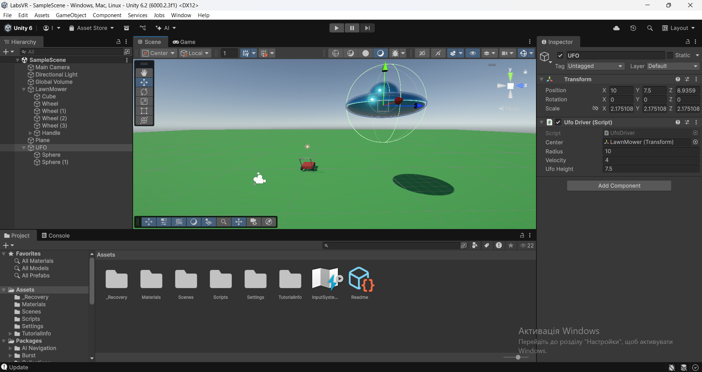

# Лабораторна робота №2
ІП-23 Гончаренко Іван

## Завдання
Завдання

1. Добавити та налаштувати камеру (CinemachineCamera)

2. Реалізувати повноцінне переміщення ігрового об’єкта (вправо-вліво, вверх-вниз в залежності від вашої сцени, але має бути переміщення по двом координатам, або переміщення та повороти)

3. Реалізувати зіткнення з об’єктами

4. Добавити теги та реалізувати різні дії в залежності від тегів

5. Створити свій, як мінімум один Prefab об’єкт та розташувати його на сцені

## Опис проекту

Проект містить одну сцену з освітленням та 3D об'єктами - газонокосаркою (LawnMower), НЛО (UFO) та площиною (Plane)

Водночас об'єкти LawnMower та UFO також складаються з більш примітивних об'єктів таких як куб, циліндр та сфера

Камера сцени налаштована на стеження за об'єктом LawnMower за допомогою CinemachineCamera

За допомогою клавіш "W" та "S" або стрілочок вверх/вниз користувач може переміщати газонокосарку вперед або назад віповідно. За допомогою стрілок "A" та "D" користувач може повертати газонокосарку (LawnMower). Об'єкт НЛО обертається навколо газонокосарки автоматично

При зіткненні з пожежним гідрантом буде виливатися вода, а при зіткненні з кубом він змінить колір на золотий

Проект містить 5 Prefab-об'єктів, а саме:

+ “алхімічний” куб (AlchemicCube)
+ пожежний гідрант (Hydrant)
+ газонокосарка (LawnMower)
+ НЛО (UFO)
+ колесо газонокосарки (Wheel)

## Скріншот проекту

## Структура проекту

Основний код знаходиться в директорії [Assets/Scripts](Assets/Scripts). 

### [WheelController.cs](Assets/Scripts/Driver.cs)

Клас, призначений для переміщення газонокосарки за допомогою компонентів WheelCollider

### [UfoDriver.cs](Assets/Scripts/UfoDriver.cs)

Клас, призначений для переміщення НЛО

### [OnHydrantHit.cs](Assets/Scripts/OnHydrantHit.cs)

Клас, призначений для обробки зіткнення з гідрантом

### [OnCubeHit.cs](Assets/Scripts/OnCubeHit.cs)

Клас, призначений для обробки зіткнення з "алхімічним" кубом